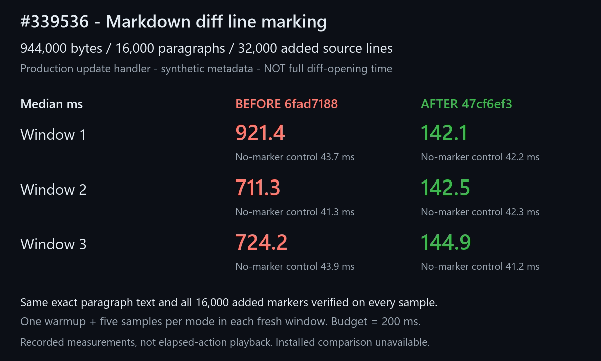
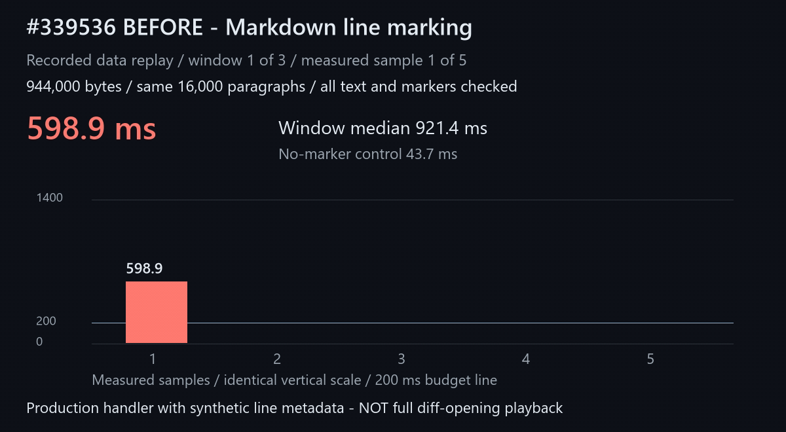
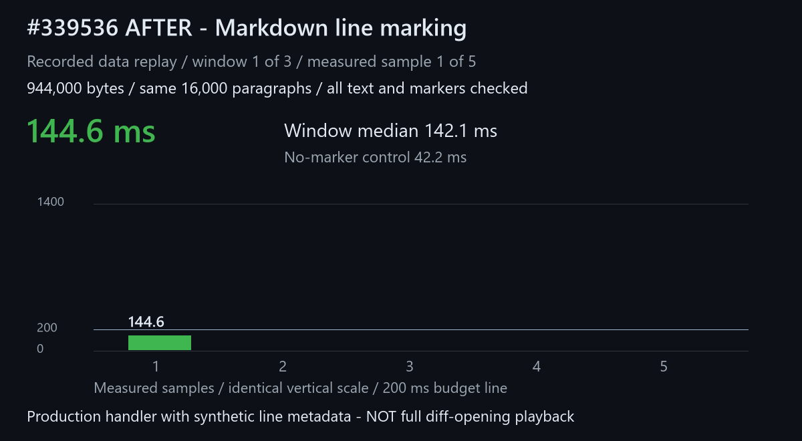

<!--
Copyright (c) Microsoft Corporation. All rights reserved.
Licensed under the MIT License. See the VS Code repository's License.txt.
-->

# Markdown diff line-marking reproduction

Evidence for [microsoft/vscode#339536](https://github.com/microsoft/vscode/issues/339536).

**Scope:** the real built-in Markdown preview's synchronous `updateContent` handler, supplied with synthetic, valid added-line metadata. This is **not a full diff-opening, parsing, or end-to-end latency benchmark**. No production handler is replaced or instrumented in the measured scenario.

## Results

Same **944,000 bytes, 16,000 numbered paragraphs, and 32,000 added source lines**:

| Fresh window | Before median | After median | No-marker control, before / after |
| --- | ---: | ---: | ---: |
| 1 | 921.4 ms | 142.1 ms | 43.7 / 42.2 ms |
| 2 | 711.3 ms | 142.5 ms | 41.3 / 42.3 ms |
| 3 | 724.2 ms | 144.9 ms | 43.9 / 41.2 ms |

Each size and mode has one warmup and five measured samples. All 15 large marked samples fail the 200 ms budget before and pass it after. Every sample checks **every paragraph's independently generated exact text**, the paragraph count, and every expected added marker. Unmarked controls require zero added markers. The unchanged scenario also covers 100 and 8,000 paragraphs, plus its original scroll controls.

- Before: `6fad7188e7dbf7db564e5e4a85960eb2bf69bdf4`.
- After: `47cf6ef3570078b80cee82628c999de0217cb47c`.
- Windows x64, Code OSS 1.141.0 Dev, Node 24.20.0. One owned window at a time on a shared host.
- Installed Insiders comparison is unavailable because its shared installation has a pending update. The update was neither applied nor bypassed.
- [All measured arrays and correctness checks](metrics.json) contain no machine-local paths.



### Before



### After



Both GIFs are **four-second recorded-data replays**, not real-time action playback. They show the five measured samples from window 1 on the same vertical scale, without startup lead-in.

## Portable reproduction

1. Start with a locally built VS Code source checkout and its compiled scenario runner, following the repository's development instructions. Compile the relevant extension from that checkout:

   ```powershell
   npm --prefix extensions\markdown-language-features run compile
   ```

2. Download this folder, retaining the `repro` subfolder and both fixture directories. No personal documents or accounts are required. For example, place it at `C:\temp\markdown-line-marking-339536`.
3. From the VS Code checkout, remove inherited Electron Node mode and run:

   ```powershell
   Remove-Item Env:ELECTRON_RUN_AS_NODE -ErrorAction SilentlyContinue
   node test\scenario\out\runScenario.js --dev C:\temp\markdown-line-marking-339536\repro\line-marking.scenario.cjs
   ```

   Repeat in three fresh windows. Before the fix, the final `expected-budget` step fails while all exact text and marker checks pass. With the fix, every step passes. The scenario generates at most 944,000 bytes per Markdown document in an isolated temporary workspace; it does not edit personal files.

The recorded runs used the Bug Swarm wrapper with `--checkout <built checkout> --isolation w2-fix-markdown --repeat 3`, under the shared measurement lease. The portable command above uses the same repository runner and the same scenario, helper, inputs, assertions, warmup, sample count, and 200 ms threshold.

The helper writes generated metrics and request/response JSON alongside the copied scenario and reports its temporary workspace. Remove only those generated files and that reported workspace when finished.

## Additional compatibility validation

The separately published [behavior scenario](repro/behavior.scenario.cjs) passes six steps against the fixed build:

```powershell
node test\scenario\out\runScenario.js --dev C:\temp\markdown-line-marking-339536\repro\behavior.scenario.cjs
```

It verifies ordinary preview text, nested lists, multiline paragraphs and fenced code; unordered/duplicate added and deleted source lines against the legacy mapping oracle; incoming predecorated HTML; empty content and cleared changes; source-selection scrolling and exact double-click navigation; real inline and side-by-side diffs; all source text and separately rendered tooltip text; inner highlights; keyboard anchor navigation; and a real document edit clearing all decorations.

Double-click navigation is explicitly enabled for that check. Scroll gestures wait for 250 ms of scroll/resize quiescence, allowing the existing 100/200 ms feedback-suppression timers to expire. This is compatibility coverage for settled gestures, not a claim about rapid-scroll races or universal absence of regressions.

Targeted extension tests passed **16/16** (seven mapping tests and nine engine tests). The deterministic linear-work regression fails with the legacy scan at **5,124,798 line reads**, while six compatibility controls pass.
